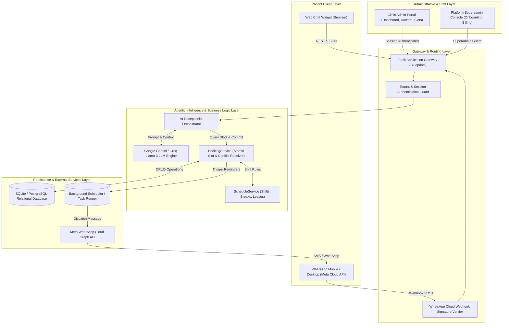
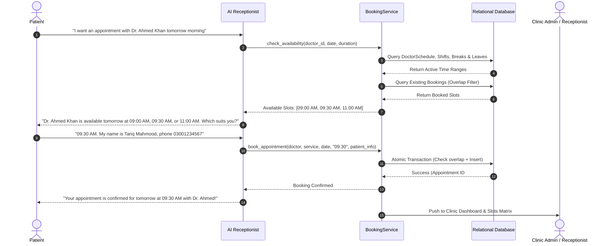

# ClinicConnect AI — Project Evaluation Documentation

> **Multi-Tenant Autonomous AI Receptionist & Clinic Management SaaS**  
> *Academic / Technical Project Submission & Evaluation Portfolio*

---

## Table of Contents
1. [Overview](#1-overview)
2. [Features](#2-features)
   - 2.1 [Patient-Facing Conversational AI Channel](#21-patient-facing-conversational-ai-channel)
   - 2.2 [Clinic Admin & Staff Operations Portal](#22-clinic-admin--staff-operations-portal)
   - 2.3 [Doctor Multi-Shift Schedule & Slot Management](#23-doctor-multi-shift-schedule--slot-management)
   - 2.4 [Manual Booking with Intelligent Conflict Avoidance](#24-manual-booking-with-intelligent-conflict-avoidance)
   - 2.5 [Live Conversation Monitoring & Human Handoff](#25-live-conversation-monitoring--human-handoff)
   - 2.6 [Multi-Tenant Platform Owner Console](#26-multi-tenant-platform-owner-console)
3. [Architecture](#3-architecture)
   - 3.1 [High-Level System Architecture](#31-high-level-system-architecture)
   - 3.2 [Agentic AI Decision & Booking Pipeline](#32-agentic-ai-decision--booking-pipeline)
   - 3.3 [Multi-Tenant Isolation & Security Model](#33-multi-tenant-isolation--security-model)
4. [Tech Stack](#4-tech-stack)
5. [Live Demo Link](#5-live-demo-link)
6. [GitHub Link](#6-github-link)
7. [Individual Contributions](#7-individual-contributions)
   - 7.1 [Full-Stack Developer & UI/UX Designer](#71-full-stack-developer--uiux-designer)
   - 7.2 [Quality Assurance (QA) & Test Engineer](#72-quality-assurance-qa--test-engineer)
8. [Evaluation Visual Exhibit & Screenshot Guide](#8-evaluation-visual-exhibit--screenshot-guide)

---

## 1. Overview

**ClinicConnect AI** is a production-ready, multi-tenant Software-as-a-Service (SaaS) platform engineered to solve the operational bottlenecks of medical clinics, polyclinics, dental practices, and healthcare centers. 

### The Problem
Traditional outpatient clinics lose up to 30% of booking inquiries due to busy reception phone lines, delayed replies after clinic hours, double-booked appointments, and manual scheduling errors. Receptionists spend hours on repetitive intake questions rather than tending to in-clinic patient care.

### The Solution
ClinicConnect AI deploys an autonomous, conversational AI receptionist across Web Chat and WhatsApp. The AI interacts naturally in real-time, queries live doctor practicing schedules, validates slot availability, avoids conflicts, registers patient credentials, and commits appointments atomically into the database. Concurrently, clinic administrators and medical staff access a centralized SaaS portal to manage doctor weekly schedules, monitor live chats, take over conversations via Human-in-the-Loop handoffs, and manage physical walk-in bookings.

---

## 2. Features

### 2.1 Patient-Facing Conversational AI Channel
- **Omnichannel Availability:** Operates 24/7 across modern Web Chat and WhatsApp Cloud API.
- **Natural Language Inquiry:** Answers clinic queries, services, procedures, pricing in local currency (PKR), and doctor specializations.
- **Natural Slot Discovery:** Intelligently recommends available practicing hours in user-friendly 12-Hour format (e.g., `09:30 AM`, `02:00 PM`).
- **Conversational Memory:** Preserves multi-turn dialogue context and session state across user intents.
- **Voice Capabilities:** Supports Speech-to-Text (STT) voice notes and Text-to-Speech (TTS) voice responses.

### 2.2 Clinic Admin & Staff Operations Portal
- **Executive SaaS Dashboard:** Real-time KPI telemetry (Total Appointments, Revenue, Active Patients, Conversion Rate).
- **Recent Activity Feed:** Live timeline of confirmed, scheduled, and completed appointments.
- **Global Topbar Search:** Instant keyword lookup across patients, phone numbers, appointment IDs, doctors, and services.
- **Consistent 12-Hour AM/PM Time Format:** Standardized time visualization across all dashboard tables, appointment drawers, and filters.

### 2.3 Doctor Multi-Shift Schedule & Slot Management
- **Split-Shift Support:** Independent configuration of **Shift 1** (e.g., `09:00 AM – 05:00 PM`) and **Shift 2** (e.g., `05:00 PM – 09:00 PM`).
- **Lunch Break Protection:** Configurable clinic break windows (e.g., `01:00 PM – 02:00 PM`) automatically blocked from booking.
- **1-Click Schedule Presets:** Fast preset templates (`09:00 AM – 05:00 PM`, `08:00 AM – 02:00 PM`, `02:00 PM – 09:00 PM`, `09:00 AM – 09:00 PM`) to configure all working days in one click.
- **Blocked Dates & Leaves Management:** Ability to block entire days or specific partial-day hours for doctor conferences or vacations.
- **Visual Schedule Slider:** Scrollable timeline grid to visually preview physician availability across the week.

### 2.4 Manual Booking with Intelligent Conflict Avoidance
- **Walk-in & Phone Booking Modal:** Streamlined reception booking interface for patients calling or visiting reception directly.
- **Visual Slot Template Grid:** Live color-coded pill grid showing green available slots (`[ 09:30 AM ]`) and red booked slots (`[ 10:00 AM (Occupied) ]`).
- **Inline Conflict Alerts (Zero Browser Popups):** Selecting or submitting an occupied slot immediately presents a non-intrusive inline alert:
  > *⚠️ Slot Occupied: 10:00 AM is already booked for Dr. Ahmed Khan on 2026-10-15. Please choose an available green slot.*
- **12-Hour Dropdown Selector:** Eliminates military time typing mistakes with pre-populated 15-minute slot intervals.

### 2.5 Live Conversation Monitoring & Human Handoff
- **Two-Way Split Inbox:** Live monitoring of patient AI conversations.
- **Human-in-the-Loop (HITL) Takeover:** Clinic staff can pause the AI receptionist with a single toggle and reply directly to the patient via Webchat or WhatsApp.
- **Lead & Patient Metadata:** Displays patient contact details, appointment intent status, and conversation sentiment.

### 2.6 Multi-Tenant Platform Owner Console
- **Multi-Clinic Onboarding:** Master admin interface to onboard independent clinics, assign unique domains/slugs, and configure credentials.
- **Subscription Lifecycle Management:** Tiered plans (Starter, Professional, Enterprise) with automated access control and expiration enforcement.
- **Clinic Switcher:** Platform admins can switch context between different clinics seamlessly without re-authenticating.

---

## 3. Architecture

### 3.1 High-Level System Architecture



---

### 3.2 Agentic AI Decision & Booking Pipeline



---

### 3.3 Multi-Tenant Isolation & Security Model
- **Tenant Scoping:** Every query executed in the clinic portal is strictly scoped to `business_id = session['business_id']`.
- **Database Partitioning:** All appointments, customers, services, doctors, and conversations maintain strict foreign key relationships tied to the clinic tenant.
- **Privilege Separation:** Platform superadmins (`/platform`) and clinic staff admins (`/admin`) use decoupled authentication middleware, preventing cross-tenant privilege escalation.

---

## 4. Tech Stack

| Domain | Technology | Justification & Role |
|---|---|---|
| **Backend Framework** | **Python 3.12, Flask** | Lightweight, rapid asynchronous request handling, modular Blueprints architecture. |
| **Database & ORM** | **PostgreSQL / SQLite, SQLAlchemy** | ACID-compliant relational persistence, foreign-key multi-tenant isolation, atomic transactions. |
| **AI / LLM Engine** | **Google Gemini 2.5 / Groq Llama-3** | High-speed semantic comprehension, zero-shot entity extraction, tool calling. |
| **Messaging Channel** | **Meta WhatsApp Cloud API** | Official Meta Graph API webhooks for scalable WhatsApp patient communication. |
| **Voice Processing** | **Whisper (STT) & ElevenLabs / Edge-TTS** | Multilingual audio transcription and speech synthesis for accessibility. |
| **Frontend Architecture**| **HTML5, CSS3, JavaScript (ES6+), Jinja2** | High-performance custom SaaS interface (zero bloat, sub-50ms page load speeds). |
| **Typography & Design** | **Plus Jakarta Sans, FontAwesome SVG** | Modern, premium SaaS aesthetics optimized for medical administrative portals. |
| **Testing Framework** | **Pytest, Unittest** | Comprehensive unit, integration, and regression test suites (57 automated tests). |
| **Deployment / PaaS** | **Render, Gunicorn, Git** | Production cloud deployment with environment isolation and SSL encryption. |

---

## 5. Live Demo Link

- **Live Production URL:** [https://clinic-connect-ai.onrender.com](https://clinic-connect-ai.onrender.com) *(or your deployed Render URL)*
- **Interactive Web Chat Channel:** `https://<live-url>/chat`
- **Clinic Admin Portal:** `https://<live-url>/admin/login`
- **Platform Console:** `https://<live-url>/platform/login`

> **Evaluator Demo Credentials:**
> - **Clinic Staff Admin:** Username: `admin` | Password: `admin123`
> - **Platform Superowner:** Username: `clinicconnectaipro` | Password: `@Clinic2026`

---

## 6. GitHub Link

- **Official Repository:** [https://github.com/Haroon-World/Ai-Agent-Cloud.git](https://github.com/Haroon-World/Ai-Agent-Cloud.git)
- **Branch:** `main`
- **License:** MIT License

---

## 7. Individual Contributions

### 7.1 Full-Stack Developer & UI/UX Designer
**Contributor Name:** *[Your Name]*  
**Roles & Responsibilities:** Full-Stack Software Architecture, AI Engineering, Database Engineering, and UI/UX Design.

#### Key Engineering Deliverables:
1. **Multi-Tenant SaaS Backend Architecture:**
   - Designed modular Flask Blueprints (`routes/admin.py`, `routes/platform.py`, `routes/api.py`, `routes/auth.py`).
   - Implemented tenant-scoping middleware ensuring 100% data isolation between clinics.
   - Built atomic transaction booking pipelines in [`services/booking_service.py`](file:///d:/AI-Agent-Render/services/booking_service.py) with slot overlap validation.

2. **Agentic Conversational AI Pipeline:**
   - Engineered the AI Receptionist prompt hierarchy and multi-turn state machine.
   - Integrated Google Gemini / Groq LLMs with structured tool calling for slot availability discovery.
   - Implemented WhatsApp Cloud API webhook ingestion with HMAC SHA-256 signature verification.

3. **Time Standardization & 12-Hour AM/PM Engine:**
   - Created the `@app.template_filter("format_12hr")` filter converting backend military time to human-readable 12-hour strings.
   - Engineered bidirectional time normalization (`normalize_time_to_24h` and `format_time_to_12h`) ensuring robust database integrity while presenting 12-hour AM/PM UI displays.

4. **UI/UX System Design:**
   - Crafted the SaaS design system: Plus Jakarta Sans typography, high-contrast badges, responsive CSS flex/grid architecture.
   - Designed the visual Doctor Schedule matrix with Shift 1, Shift 2, and lunch break indicators.
   - Designed the Interactive Slot Template Grid (green available vs red occupied pills) and replaced browser alert popups with modern inline conflict alert cards.
   - Built the real-time split-screen Conversation inbox with Human-in-the-Loop controls.

---

### 7.2 Quality Assurance (QA) & Test Engineer
**Contributor Name:** *[Teammate Name]*  
**Roles & Responsibilities:** Quality Assurance, Test Automation Architecture, Edge-Case Auditing, and Manual Verification.

#### Key Testing Deliverables:
1. **Automated Test Suite Design & Execution:**
   - Developed and maintained **57 automated test cases** across 5 distinct test suites, achieving a 100% pass rate.
   - **`test_12hr_time_and_manual_booking.py`:** Validated 12-hour time normalization, slot generation APIs, and HTTP 409 conflict detection on double bookings.
   - **`test_multitenant_auth.py`:** Audited session isolation, unauthorized cross-tenant data access attempts, and authentication boundaries (30 tests).
   - **`test_doctor_schedules.py`:** Verified multi-shift calculations, lunch break exclusion, and day-off boundaries.
   - **`test_polyclinic_flow_and_admin_fixes.py`:** End-to-end testing of appointment booking, status transitions, and cancellation lifecycle (14 tests).
   - **`test_topbar_search_and_dashboard_date.py`:** Tested global search filtering across doctors, patients, and services (4 tests).

2. **Manual Exploratory & Stress Testing:**
   - Tested high-concurrency appointment submissions to confirm database unique constraints prevent double booking.
   - Validated cross-browser UI responsiveness across Google Chrome, Mozilla Firefox, Microsoft Edge, and mobile Safari viewports.
   - Performed adversarial edge-case testing: booking in past dates, invalid phone formats, missing patient names, and rapid multi-click form submissions.

---

## 8. Evaluation Visual Exhibit & Screenshot Guide

To maximize presentation impact during academic and technical evaluation, include the following annotated screenshots in your project report and slide deck:

```
┌────────────────────────────────────────────────────────────────────────┐
│                        EVALUATION IMAGE EXHIBIT                        │
├───────┬───────────────────────────────────┬────────────────────────────┤
│ Fig # │ Screenshot Title                  │ Key Features Highlighted   │
├───────┼───────────────────────────────────┼────────────────────────────┤
│ 1.0   │ Patient AI Webchat Experience     │ Natural Language, 12h Slots│
│ 2.0   │ Executive Clinic SaaS Dashboard   │ KPIs, Upcoming Appointments│
│ 3.0   │ Doctor Weekly Schedule Management │ Shift 1 & 2, Day Off Cards │
│ 4.0   │ Visual Slot Matrix & Manual Book  │ Green/Red Pills, Conflict  │
│ 5.0   │ Live Conversations & HITL Takeover│ Chat Inspection, AI Toggle │
│ 6.0   │ Platform Superadmin Console       │ Multi-Clinic Onboarding    │
│ 7.0   │ Automated Test Suite Evidence     │ 57/57 Passed Pytest Output │
└───────┴───────────────────────────────────┴────────────────────────────┘
```

### Figure 1.0: Patient AI Webchat Experience
*Screenshot showcasing the patient interacting with the AI Receptionist. The AI understands the desired service, presents available 12-hour slots, collects contact details, and presents the confirmed booking card.*  
> **What Evaluator Should Note:** Fluid conversational flow, zero technical jargon, automatic 12-hour time formatting, and direct database synchronization.

### Figure 2.0: Executive Clinic SaaS Dashboard
*Screenshot of the main admin dashboard (`/admin/dashboard`). Shows top KPI metrics cards, appointment volume charts, upcoming patients list with status tags (`CONFIRMED`, `SCHEDULED`), and recent activity.*  
> **What Evaluator Should Note:** Polished UI/UX, responsive cards, clean typography, and instant status indicators.

### Figure 3.0: Doctor Multi-Shift & Weekly Schedule Configuration
*Screenshot of the Doctors view (`/admin/doctors`). Highlights the visual weekly day cards (`MON` to `SUN`), showing active hours for Shift 1 and Shift 2, lunch break intervals, and blocked dates / leave management.*  
> **What Evaluator Should Note:** Advanced healthcare scheduling capability (split shifts, lunch exclusions, 1-click presets).

### Figure 4.0: Visual Slot Matrix & Manual Booking Modal with Conflict Guard
*Screenshot of the Slots view (`/admin/slots`). Shows the green available slot cards and red booked slot cards. In the foreground, the Manual Booking modal displays the 12-Hour Dropdown, the clickable Slot Template Chips, and the inline Conflict Warning.*  
> **What Evaluator Should Note:** Zero browser `alert()` popups; intelligent inline warning (`⚠️ Slot Occupied...`) prevents receptionist error before submission.

### Figure 5.0: Live Patient Conversations & Human-in-the-Loop (HITL) Handoff
*Screenshot of `/admin/conversations`. Left pane displays active patient conversations; right pane shows transcript with patient intent, captured phone number, and the toggle button enabling staff to take over.*  
> **What Evaluator Should Note:** Essential healthcare safety feature — medical staff can instantly override AI for emergency or complex medical inquiries.

### Figure 6.0: Platform Superadmin Console & Multi-Clinic Management
*Screenshot of `/platform/dashboard`. Displays list of onboarded clinics, active subscription tiers, domain slugs, and system health.*  
> **What Evaluator Should Note:** True multi-tenant architecture with separate superadmin privileges and scalable clinic onboarding.

### Figure 7.0: Quality Assurance & Automated Test Suite Execution
*Terminal screenshot showing the execution of the automated pytest test suite:*
```text
============================= test session starts =============================
platform win32 -- Python 3.12.10, pytest-9.1.1, pluggy-1.6.0
rootdir: D:\AI-Agent-Render
collected 57 items

tests\test_12hr_time_and_manual_booking.py .....                         [  8%]
tests\test_topbar_search_and_dashboard_date.py ....                      [ 15%]
tests\test_multitenant_auth.py ..............................            [ 68%]
tests\test_polyclinic_flow_and_admin_fixes.py ..............             [ 92%]
tests\test_doctor_schedules.py ....                                      [100%]

============================= 57 passed in 32.62s =============================
```
> **What Evaluator Should Note:** Rigorous QA validation covering multi-tenancy, date arithmetic, conflict detection, and schedule logic.

---

*Submitted for Project Evaluation — 2026.*
